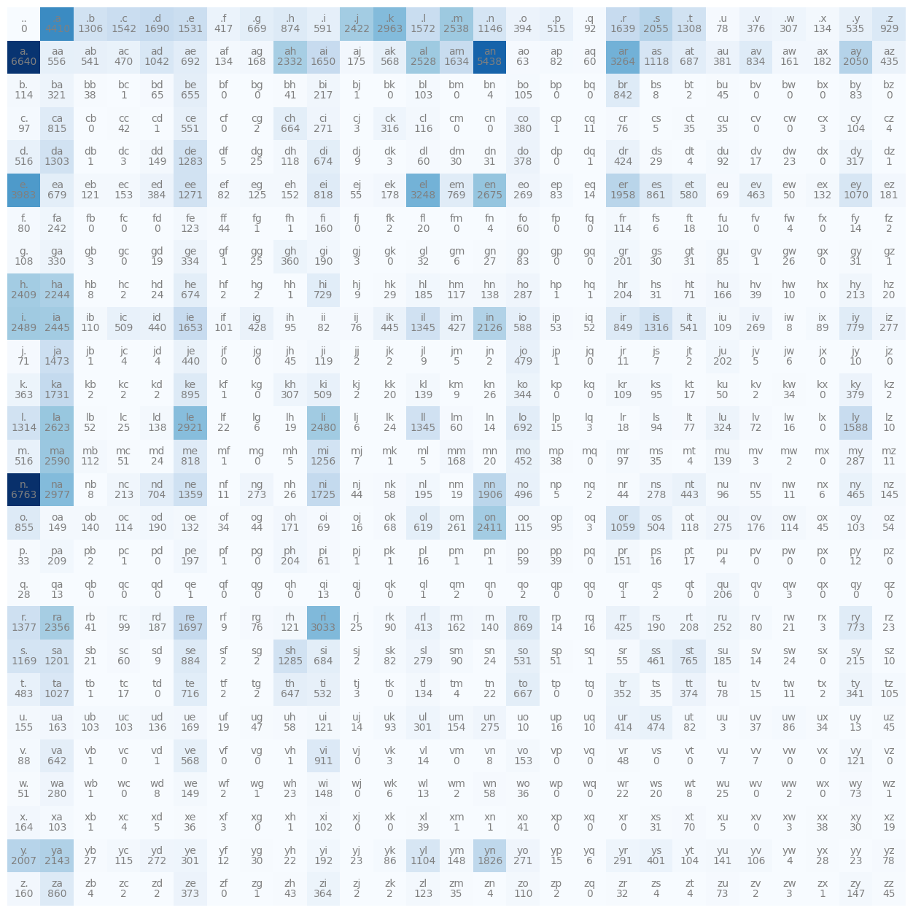

# Makemore: Character Level Language Models

A step by step approach to building language models from scratch.

This repository is built to replicate the existing [makemore project](https://github.com/karpathy/makemore) built by Andrej Karpathy.

## Names from the dataset

Example names from the dataset:

```
['emma',
 'olivia',
 'ava',
 'isabella',
 'sophia',
 'charlotte',
 'mia',
 'amelia',
 'harper',
 'evelyn'
 ]
```

## Bigram character model

Bigram models predict the next character based on the previous character.

### Building the bigram matrix N

The bigram matrix `N` is a 27×27 matrix that counts how many times each character follows another character in the dataset. It consists of 26 letters (a-z) and 1 special token `.` used to mark both the start and end of words.

#### Creating character mappings

First, we create lookups from character to number and vice versa:

```python
chars = sorted(list(set(''.join(words))))
# s to i: mapping from character to integer
stoi = {s: i+1 for i, s in enumerate(chars)}
# special token for both start and end of word
stoi['.'] = 0
# reverse the dictionary stoi --> itos
itos = {i: s for s,i in stoi.items()}
```

In the above code, `stoi` (string to integer) would be as follows:

```
stoi = 
{
 '.': 0,
 'a': 1,
 'b': 2,
 'c': 3,
    ...
 'z': 26}
```

`itos` (integer to string) is simply the reverse of `stoi`.

#### Populating the matrix N

For each word, we create character pairs (bigrams) including the special `.` token at the start and end, then increment the corresponding position in matrix `N`:

```python
for w in words:
    chs = ["."] + list(w) + ["."]
    for ch1, ch2 in zip(chs, chs[1:]):
        # now for both the characters get the index
        ix1 = stoi[ch1]
        ix2 = stoi[ch2]
        # now increment the 2D tensor N
        N[ix1, ix2] += 1
```

Each entry `N[i, j]` represents the count of how many times character `j` follows character `i` in the dataset. For example:
- `N[0, 1]` counts how many times 'a' appears at the start of a word (after '.')
- `N[1, 2]` counts how many times 'b' follows 'a'
- `N[5, 0]` counts how many times a word ends after 'e' ('.' follows 'e')

The final `N` matrix looks like the following:

